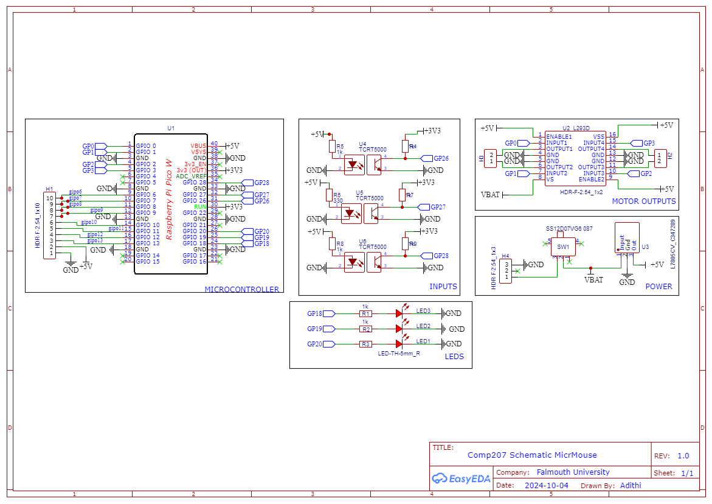

# MicroMouse Project - COMP207 Module

## Goal 
This project focuses on designing and constructing a compact autonomous robot capable of navigating a maze using only onboard sensors. The robot is developed in compliance with the **UK Micromouse Classic Rules**, ensuring alignment with national standards. The process encompasses digital prototyping and basic C++ programming to achieve this goal.

  
  
  

---

## Overview Technologies and Tools  
- **3D Modeling and Printing**: Designs were created and refined using **Autodesk Fusion 360**, then fabricated as physical prototypes using 3D printing techniques.  
- **Laser Cutting**: Precision manufacturing was applied to create structural components, with designs prepared using **Fusion 360**.  
- **PCB Design**: Custom printed circuit boards were created using **EasyEDA**, enabling the integration of electronic systems tailored to the project requirements.  
- **3D Scanning**: Geometric data was captured for reverse engineering and design validation, supporting iterative improvements.  
- **Development Log**: All progress, milestones, and insights were documented in **Notion**, providing a clear and organized record of the project lifecycle.  
- **Cloud Collaboration**: The entire project, including code, documentation, and media, is managed in this **GitHub**, ensuring version control and accessibility for others.
---

## Competition Rules
This project follows the **UK Micromouse Classic Rules**. The fundamental challenge is for the robot to autonomously navigate a maze without any external input other than that provided by its onboard sensors. 

---

## Folder Structure and Repository Contents  

- **CAD**  
  - 3D models, assemblies, simulations, renders (Autodesk Fusion 360)  

- **Code**  
  - Software for navigation, sensor integration, and control  

- **Electronics**  
  - PCB designs, wiring diagrams, schematics (EasyEDA)  

- **Documentation**  
  - Development logs, reports, research (Notion)  

- **Media**  
  - Images, videos, progress, and results  

---

## Documentation  
All project documentation is organized within **Notion** for easy access and reference. Entries are categorized by session types, including:
- **Workshop**
- **Lecture**
- **Notes**
- **Self-Study**
- **Supervisor Meetings**

This categorization ensures that each task is easily traceable by the session in which it was undertaken.

### Each entry includes:
- **Objective**: The primary goal or focus of the session.
- **Learnings & Reflections**: Key insights, observations, and personal evaluations from the session.
- **Evidence**: Supporting materials such as images, videos, code snippets, and complete project files.

This structured approach ensures all information is well-documented and readily accessible for review and reference.

Access the documentation [here](https://www.notion.so/10b0f7ecc39f80009395e716d8205f3d?v=fff0f7ecc39f8130998c000c51e422c1&pvs=4).

---

## Part 1: Components Required
The following components are required as the foundation for initiating the project:
All datasheets provide detailed specifications, images, functions, and usage guidelines for each component. For further information, refer to the links in the table above.

| **Component**                    | **Data Sheet**                                                                                      | **User Contribution/Component ID**                                         |
|-----------------------------------|-----------------------------------------------------------------------------------------------------|----------------------------------------------------------------------------|
| **Raspberry Pi Pico**             | [Raspberry Pi Pico DataSheet](https://github.falmouth.ac.uk/AJ301574/COMP207-project/blob/main/Documentation/datasheets/Rasberry%20Pi%20Pico%20DataSheet.pdf) | C7203003                                                                  |
| **Motor Driver L293D**            | [Motor Driver L293D DataSheet](https://github.falmouth.ac.uk/AJ301574/COMP207-project/blob/main/Documentation/datasheets/H%20Drive%20l293d%20DataSheet.pdf) | C12340                                                                    |
| **Motor Driver GA12-N20**         | [Motor Driver GA12-N20 DataSheet](https://github.falmouth.ac.uk/AJ301574/COMP207-project/blob/main/Documentation/datasheets/Motor%20Driver%20GA12-N20%20DataSheet.pdf) | GA12-N20 Motor Driver ID                                                  |
| **Proximity Sensor TCRT5000**     | [Proximity Sensor TCRT5000 DataSheet](https://github.falmouth.ac.uk/AJ301574/COMP207-project/blob/main/Documentation/datasheets/Proximity%20Sensor%20TCRT5000%20DataSheet.pdf) | C2984661                                                                  |
| **Voltage Regulator L78XX**       | [Voltage Regulator L78XX DataSheet](https://github.falmouth.ac.uk/AJ301574/COMP207-project/blob/main/Documentation/datasheets/Voltage%20Regulator%20L78XX%20DataSheet.pdf) | C347289                                                                   |
| **LEDs**                          | Visual indicators for the robot's status and operation                     | No User Contribution ID required                                           |
| **Switch**                        | Controls power and circuit state                                         | C2939728                                                                  |
| **Resistors (330Ω and 1kΩ)**      | Limit current to protect components                                        | No User Contribution ID required                                           |

---
## Step 2: Designing the PCB in EasyEDA

To design the PCB, follow these steps:

### 1. **Import Components**
   - Access the *User Contributions* section within EasyEDA. (The component numbers are provided in the table above.)
   - Search for and import the required components, such as the Raspberry Pi Pico, motor drivers, sensors, and other passive components.

### 2. **Schematic Design**
   - I have attached the final schematic diagram for this project below. Please replicate the connections exactly as shown to ensure the circuit functions correctly:
   
   

### 3. **PCB Layout**
   - Once the schematic is complete, switch to the PCB layout view in EasyEDA.
   - Arrange the components on the PCB while ensuring proper spacing between them for efficient routing and minimal interference.
   - **Pro Tip**: When routing, ensure that no traces are placed too close to each other, as this could lead to shorts or signal degradation.
   - If the layout feels too cluttered, you can use the PCB's **top** and **bottom** layers to distribute the components and traces more effectively.
   - Additionally, the **junction function** can be helpful when routing complex connections or when multiple traces need to meet at a single point without excessive overlap.

### 4. **Customizing the PCB Shape**
   - You can either use the default rectangular PCB shape provided in EasyEDA or design your own custom shape for the board.
   - To create a custom shape:
     1. Use Fusion 360 to design the base shape using the required dimensions. (Create a new sketch, create the shape desired, and extrude down holes if needed)
        - Example: Refer to this drawing for guidance on the dimensions of the board used in this project:  
          

            
          

     2. Export the shape as a **DXF file** and import it into EasyEDA.
     2. Export the shape as a **DXF file** and import it into EasyEDA.
     3. When importing, ensure you select the correct **Board Outline Layer**. Once imported, the custom board shape should appear in pink.
   - You can also use this method to add **text** or **images** to your PCB for aesthetic purposes:
     1. Create the desired design in CAD software.
     2. Export it as a **DXF file** and import it into EasyEDA.
     3. Select either the **Front Silk Layer** or the **Back Silk Layer**, depending on which side of the PCB you want the design printed.
---

### Wiring the Circuit and Routing the PCB

The next step is to import your DXF file(Base) into EasyEDA and place your schematic on it. Consider the placement of components carefully to ensure proper functionality. For instance:
- The **TCRT5000 proximity sensors** should be positioned at the edges.
- The **L7805 voltage regulator** is quite tall and may interfere with the chassis design.

To make the routing process easier:
- Utilize both the **top** (red lines) and **bottom** (blue lines) layers of the PCB.
- Add a **copper layer** to the PCB to handle ground connections, reducing the need for manual wiring.
- Similarly, create a layer for **+5V connections** to save time and improve efficiency.

### PCB Layout: Top and Bottom Layers
When routing the board:
- Avoid creating arbitrary lines; aim for parallel tracks to make testing the connections easier.
- Dont use too many junctions; it might be hard later if any errors are found.
- Below are the **Top Layer** and **Bottom Layer** PCB layouts for reference:

  
  

After routing, press the **Design Rule Check (DRC)** button to verify the design. If no errors are reported, proceed to finalize the PCB design.

---

### Final PCB Layout
Once all wiring is complete, your PCB should resemble the layout below. This diagram represents the fully routed PCB design:

---

### 3D Render of the PCB
Here are the **front** and **back** 3D renders of the PCB! It should look something like this:

  
  

# **Motor Mount Design and Fabrication**

The motor mount ensures stability and proper alignment between the PCB and motor, offering both functionality and aesthetic appeal. This guide provides detailed steps to create the mount using CAD, with STL files available for download in the `CAD` folder.

---

## **Overview**
The motor mount is designed with the following objectives:
- Provide a 3mm clearance between the PCB and the mount.
- Securely attach the motor with precise dimensions.
- Include aesthetic features like chamfered edges and filleted surfaces for a polished look.

Here are the 3D model and dimension drawing for reference:

  
  

---

## **Phase 1: Base Design**
1. **Create the Base Sketch**:
   - Start a 2D sketch and draw a **90mm x 25mm rectangle**.
   - Use the **construction line tool** to locate points 25mm away from the center (east and west).
2. **Add Mounting Holes**:
   - Place circles of **3.60mm diameter** at the designated points.
   - Use the **offset tool** to add a second circle **2mm larger** around each mounting hole.
3. **Extrude the Base**:
   - Extrude the base **20mm**, leaving the circles deselected to create through-holes for mounting.

---

## **Phase 2: Motor Hole and Shape Carving**
1. **Prepare the Motor Hole**:
   - On the base's side, start a new sketch and:
     - Draw a **12mm diameter circle**.
     - Add a **10mm square** centered around the circle.
   - This prepares the area for the motor to sit securely.
2. **Shape the Mount**:
   - Use the **line tool** to define the mount's shape on the side profile.
   - Extrude the sketch through the base to carve out the shape.

---

## **Phase 3: Clearance and Aesthetic Features**
1. **Add PCB Clearance**:
   - Offset the mounting holes by **3mm** and extrude them upwards.
   - Apply a chamfer to create a ramped effect, improving the design's aesthetics.
2. **Smooth Edges**:
   - Fillet any sharp edges to make the mount visually appealing and easier to handle.
3. **Mirror the Design**:
   - Use the **mirror function** in CAD to create a mirrored version of the motor mount for the opposite side. This ensures symmetry and balance in the motor assembly.
4. **Add Bumper for Alignment and Stability**:  
   - Extrude a rectangular section from the base of the mount to serve as a stabilizing bumper.  
   - From the center of the rectangle, extrude a triangular feature outward to provide additional clearance and assist in alignment and leveling of the micromouse.  
   - Fillet the edges of both the rectangular and triangular extrusions to ensure smooth transitions, reducing wear and tear during movement.  
5. **Prepare for Fastening**:  
   - Design circular holes on either side of the rectangular extrusion to accommodate screws for securing the bumper to the motor mount.  
   - Ensure the hole diameters match standard screw sizes for compatibility and ease of assembly.  
---

## **STL and DFX Files**
The STL files for all modeled parts, including the motor mount, are in the `CAD` folder. Use these files for 3D printing or laser cutting to replicate precisely!

---

## **Micromouse Wheel Design and Laser Cutting**

The Micromouse wheels are designed to be lightweight yet sturdy, incorporating a triangular structure that reduces weight while maintaining strength. These wheels were laser cut from plywood for improved durability, as laser cutting allowed for a cleaner, more efficient process compared to 3D printing.

---

## **Overview**
The wheel design features multiple triangles in its structure, which provides strength while keeping the wheel lightweight. This design choice ensures optimal performance for the slithering bot. The wheels are laser cut to precision using plywood, which proved to be more efficient for this project than 3D printing due to its faster production time and cost-effectiveness.

Here are the 3D model and dimension drawing for reference:

  
  
  

---

## **Phase 1: Design and Structure**
1. **Create the Base Sketch**:
   - Start a 2D sketch and draw the **outer diameter** of the wheel, which is **50mm**.
   - Add the inner hole for the motor axle with a **10mm diameter**.
2. **Add Triangular Sections**:
   - Use the **polygon tool** to create multiple triangles within the circle.
   - Arrange the triangles to maximize structural integrity while minimizing weight.
3. **Extrude the Wheel Shape**:
   - Extrude the design by **3mm** (Wood thickness).

---

## **Phase 2: Laser Cutting and Final Touches**
1. **Prepare for Laser Cutting**:
   - Export the design as a **DXF** file (available in the `CAD` folder) to ensure compatibility with the laser cutting machine.
   - Double-check the dimensions to ensure accuracy.
2. **Smooth Edges**:
   - Apply any finishing touches to smooth the edges and enhance the appearance of the wheel.
3. **Laser Cutting**:
   - Laser cut the wheel design using plywood, ensuring precision and strength.

---
## PCB Assembly and Testing Guide

Once your PCB arrives, the first step is to test the connections using a multimeter. Ensure that the 5V and GND connections are properly established. If you don't hear a beep sound indicating a proper connection, please verify the connections in EasyEDA, make the necessary corrections, and reorder the PCB if required.

### 1. Soldering the Components

After verifying the connections, solder all the electronic components onto the PCB. Use the schematic diagrams as your reference for component placement. Pay special attention to components like the **TCRT5000 sensors** and **LEDs**, as they have a specific orientation and must be inserted correctly to function properly.

  
  

#### Correct Orientation of Components

- **TCRT5000 Sensors**: These sensors must be inserted with proper orientation. Look for a **curved edge** and a **sharp edge** on the outline of the TCRT5000. On the PCB, you will notice a similar pattern with a **curved edge** and a **sharp edge** marking the sensor's correct placement. Ensure that the **curved side** of the TCRT aligns with the **curved edge** on the PCB outline, while the sharp edge should align with the corresponding sharp marking on the PCB. Incorrect orientation will result in malfunction.

- **LEDs**: LEDs are polarized and only work when inserted in the correct direction. The longer leg (anode) should go into the positive (Vcc) side, while the shorter leg (cathode) should go into the negative (GND) side.

### 2. Testing the Components

After soldering the components, it’s crucial to test them individually to ensure they are functioning properly. Use the test code files available in the **Test Code** folder of the project repository.

#### 2.1 Individual Component Tests

- **LED Test**: Ensure that the LEDs light up when triggered. Verify that the LED turns on and off correctly based on the code logic.

- **TCRT5000 Sensor Test**: Measure the readings from the TCRT5000 sensors using the Serial Monitor in the Arduino IDE. This will provide you with the distance readings in centimeters, which are critical for navigation purposes.

#### 2.2 Combined Test Code

Once all individual components are verified, a combined test using the integration of LEDs and TCRT5000 sensors is performed. This will test the functionality of the entire system working together.

You can find the necessary test code for both individual and combined tests in the repository here: [Test Code](https://github.falmouth.ac.uk/AJ301574/COMP207-project/tree/main/Code/Final%20Code/Test%20Code).

---

### 3D Scanning and Micro Mouse Model

  
  

For the Micro Mouse project, I created a miniature model of a mouse using clay, which was subsequently 3D scanned using a mobile application. The scanned file was converted into an STL format, and the mesh was resized and adjusted as necessary. The resulting model was then 3D printed to serve as a decorative and thematic component atop the robot.

The STL file for this mouse model is available in the CAD folder, should you choose to use it in your own project. Alternatively, you may opt to customize your design by 3D scanning an object of your choice, incorporating any additional features, and printing the resulting model to fit your specifications.

---

### Code Explanation: Sensor and Motor Control

This section provides a brief overview of the key logic used to control the sensors and motors in the robot. The full code is available in the [Code folder](https://github.falmouth.ac.uk/AJ301574/COMP207-project/tree/main/Code).

#### Overview

- **LED Control**: The LEDs are used as indicators to show which sensor is active or if the robot is moving in a certain direction.
- **TCRT5000 Sensors**: These sensors are used to detect obstacles by measuring the reflected light intensity. The values are read using the `analogRead()` function, which helps the robot make decisions about movement.
- **Motor Control**: The motors are controlled using four pins connected to an H-Bridge. The robot moves forward, backward, or stops based on sensor input.

#### Main Logic

The logic of the robot's movement is based on readings from the TCRT5000 sensors:

1. **Obstacle Detection**: The robot checks for obstacles using three TCRT5000 sensors (front, left, and right).
   - If the **front sensor** detects an obstacle, the robot checks the **left** and **right sensors** to decide which direction to turn.
   - If no obstacle is detected in front, the robot moves forward while adjusting speed based on the sensor readings from the sides.

2. **Movement Control**: Depending on the obstacle detection:
   - If an obstacle is detected on the left, the robot will turn right.
   - If an obstacle is detected on the right, the robot will turn left.
   - If no obstacles are detected, the robot will move forward.

#### Key Functions

- **`readTCRT(pin)`**: Reads the value from the TCRT5000 sensor.
- **`setLED(pin, state)`**: Turns the LED on or off.
- **Motor control functions (`leftMotorForward`, `rightMotorBackward`, etc.)**: Control the motors to move the robot forward, backward, or stop based on the sensor inputs.

The full code implements these behaviors, ensuring the robot reacts to its environment and avoids obstacles and can slove the maze. 

---
## Market Analysis

### Feedback Summary

Feedback was collected through a targeted Google Form to refine the project, focusing on three key areas: GitHub documentation, digital prototyping, and code efficiency.

- **GitHub Documentation:**  
  Feedback highlighted the repository's clear structure but suggested improvements like adding step-by-step instructions and more visual aids to enhance accessibility for beginners.

- **Digital Prototyping:**  
  Suggestions included design adjustments, such as adding a hole in the shell for motor wires and redesigning PCB motor pins to improve durability.

- **Code Efficiency:**  
  The code was effective but required improvements in readability and speed optimization for smoother performance.

### Key Adjustments Implemented
- Added visual aids and step-by-step instructions to GitHub.  
- Updated the CAD design to include wire management and address battery placement issues.  
- Began refactoring movement logic into modular functions and adjusted robot speed for smoother operation.

A **detailed market analysis** and comprehensive feedback are available in the project development log.

---

### Final MicroMouse  

  
  
  
  

